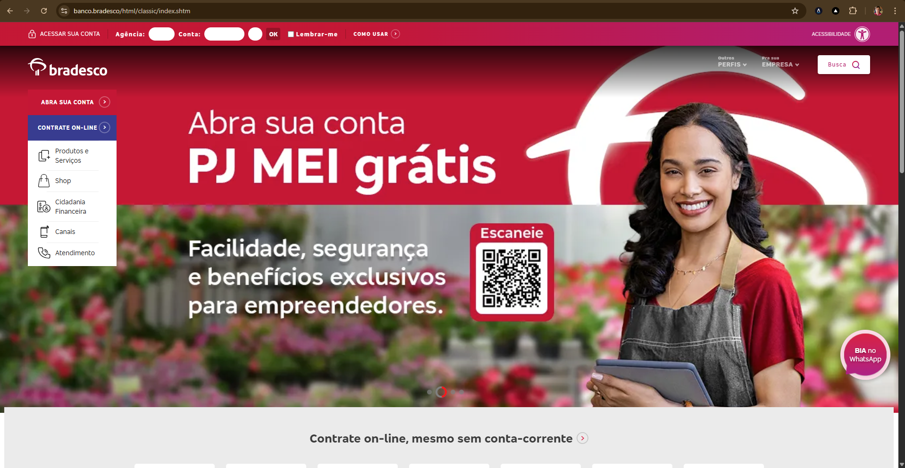
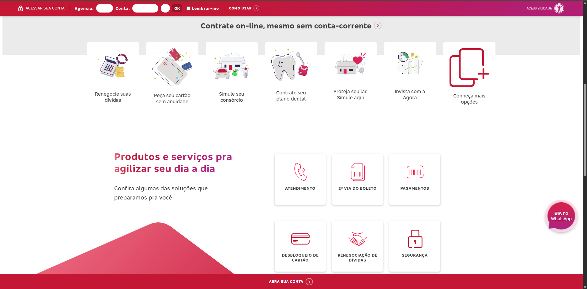
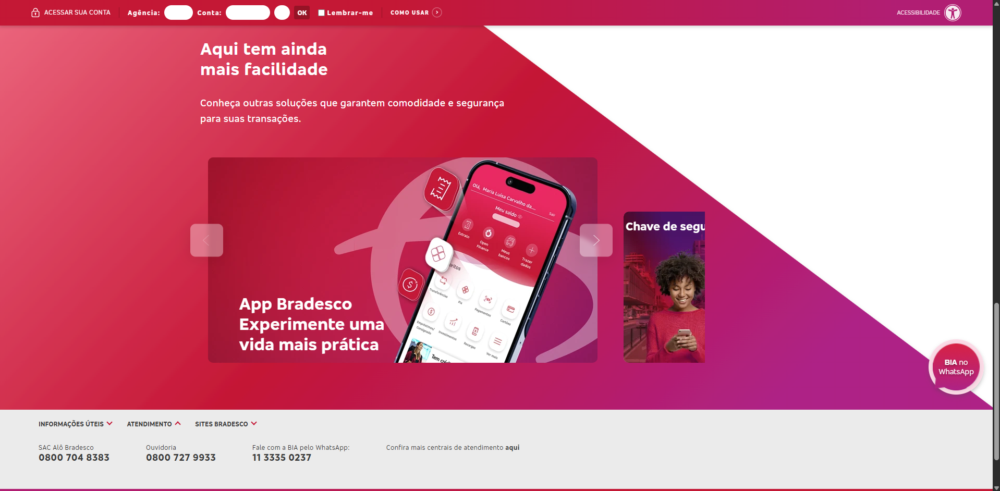
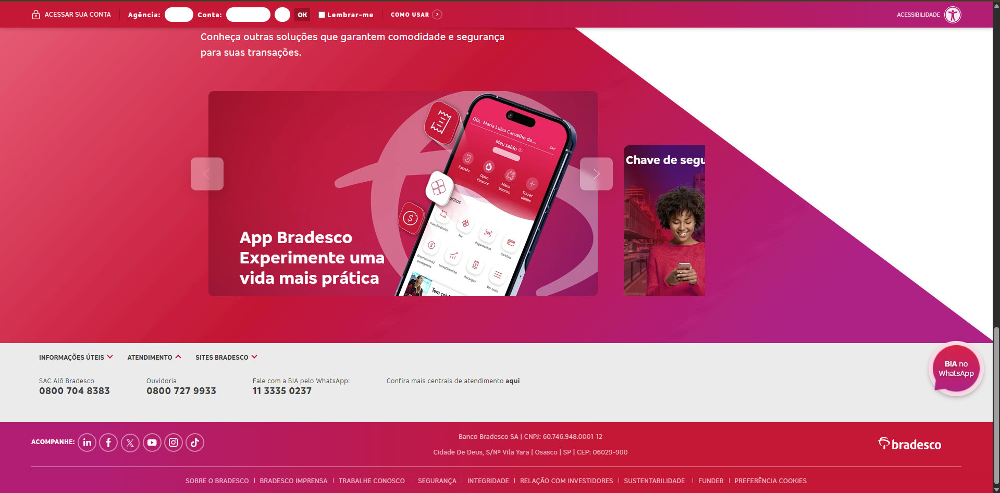
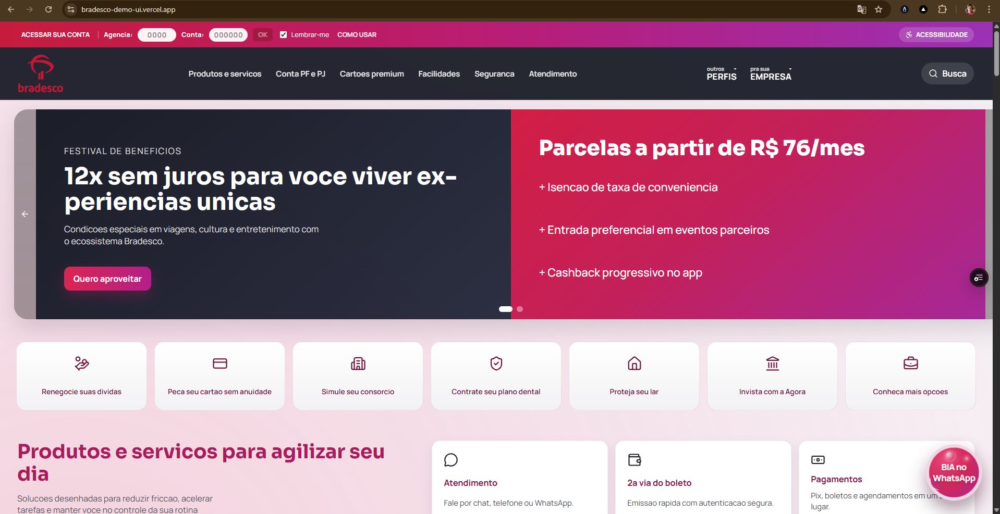
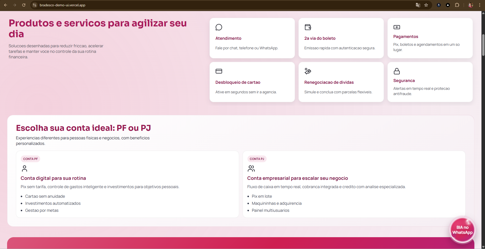
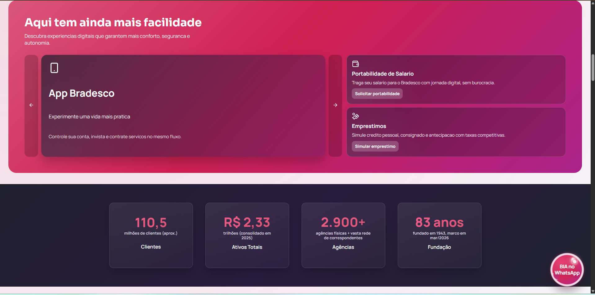
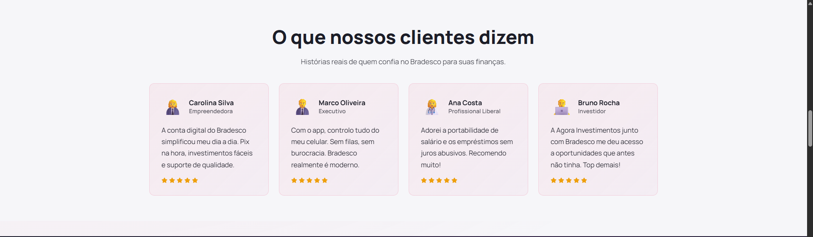
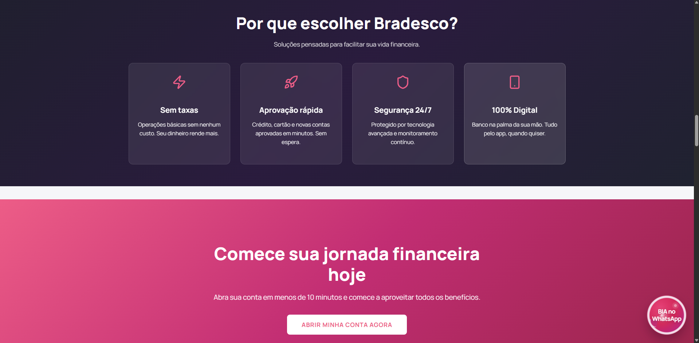
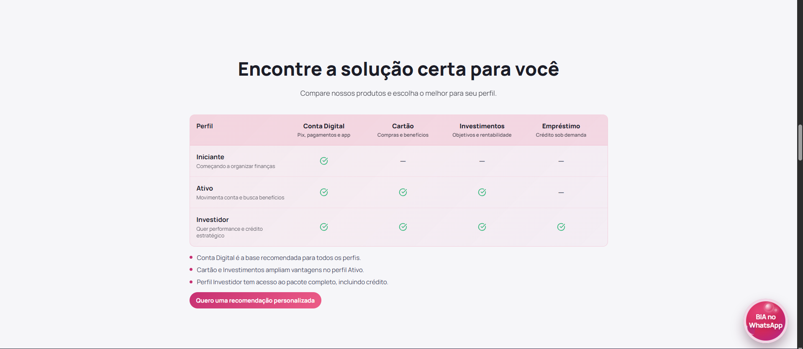

# bradesco-demo-ui

Demo (Vercel): https://bradesco-demo-ui.vercel.app/

## PT-BR

### Visao geral
Aplicacao web em React + Vite que simula a home de um banco digital inspirado no Bradesco. O projeto tem foco em experiencia moderna, performance, acessibilidade e renderizacao orientada a conteudo (JSON local ou API remota).

### Objetivos do projeto
- Exibir uma landing page bancaria completa, modular e responsiva.
- Consumir conteudo dinamico com fallback automatico para JSON local.
- Demonstrar componentes reutilizaveis, animacoes suaves e boas praticas de UX.
- Incluir recursos de acessibilidade nativos na interface.

### Stack e bibliotecas
- React 19
- Vite 8
- Framer Motion (animacoes)
- Lucide React (icones)
- React Icons (icones de redes sociais)
- ESLint 9 + jsx-a11y + react-hooks + react-refresh
- @axe-core/react (dependencia instalada para analises de acessibilidade em ambiente React)

### Funcionalidades implementadas
- Top bar com acesso a conta (agencia/conta), checkbox de lembranca e acao de ajuda.
- Painel de acessibilidade com:
	- ajuste de fonte (A- / A+),
	- alto contraste,
	- reset de preferencias.
- Navegacao desktop e menu mobile com drawer animado.
- Hero carousel com autoplay, controles manuais e indicadores.
- Secao de acoes rapidas com icones contextuais.
- Secao de produtos e servicos.
- Secao de contas por segmento (PF/PJ).
- Secao de facilidades com carousel secundario e cards em destaque.
- Secoes de conteudo adicionais:
	- estatisticas,
	- depoimentos,
	- beneficios,
	- CTA principal,
	- tabela comparativa de perfis,
	- FAQ com acordeao,
	- seguranca,
	- blog,
	- parceiros,
	- linha do tempo institucional.
- Rodape com redes sociais, links institucionais e informacoes legais.
- Botao flutuante da BIA com animacao.

### Acessibilidade e UX
- Link de salto para o conteudo principal (skip link).
- Uso consistente de `aria-label`, `aria-expanded`, `aria-controls`, `aria-live`, `role` e `aria-pressed`.
- Estados de foco visiveis para elementos interativos.
- Respeito a `prefers-reduced-motion` nas animacoes.
- Bloqueio de scroll do body quando menu mobile esta aberto.

### Arquitetura e estrutura de pastas
```text
.
|-- eslint.config.js
|-- index.html
|-- package.json
|-- README.md
|-- vite.config.js
|-- public/
`-- src/
		|-- App.css
		|-- App.jsx
		|-- index.css
		|-- main.jsx
		|-- assets/
		|   `-- bradesco-logo-oficial-2018-2.png
		|-- data/
		|   `-- homeData.json
		`-- services/
				`-- contentService.js
```

### Fluxo de dados
O app usa um servico central para buscar conteudo da home:

1. Se `VITE_CONTENT_API_URL` estiver definida, o app tenta buscar dados remotos.
2. Se a API retornar erro, payload invalido ou estiver indisponivel, o app usa `src/data/homeData.json`.
3. Se o payload remoto vier no formato `{ home: {...} }`, o servico extrai automaticamente `home`.

Esse comportamento garante resiliencia para demos e desenvolvimento local.

### Como executar localmente
Pre-requisitos:
- Node.js 20+ (recomendado)
- npm 10+ (ou equivalente)

Passos:

```bash
npm install
npm run dev
```

Aplicacao local padrao: http://localhost:5173

### Scripts disponiveis
- `npm run dev`: inicia ambiente de desenvolvimento com HMR.
- `npm run build`: gera build de producao em `dist`.
- `npm run preview`: sobe servidor local para testar o build.
- `npm run lint`: executa analise de lint no projeto.

### Variaveis de ambiente
Crie um arquivo `.env` (ou `.env.local`) na raiz para apontar API de conteudo:

```env
VITE_CONTENT_API_URL=https://sua-api.com/home
```

Se nao for definida, o app usa os dados locais automaticamente.

### Deploy
Deploy publicado em Vercel:
- https://bradesco-demo-ui.vercel.app/

Build command:

```bash
npm run build
```

Output directory:

```text
dist
```

### Escopo de conteudo atual (JSON)
`homeData.json` inclui blocos para:
- topBar, brand, nav, topMenus
- heroSlides, quickActions
- services, segments, facilities
- contacts, stats, testimonials
- benefits, maincta, comparison
- faq, security, blog, partners, timeline
- footerSocial, footerInlineLinks, footerLinks, legal

### Observacoes
- Projeto com conteudo demonstrativo para fins de UI/UX e prototipacao.
- Nao implementa autenticacao real, transacoes bancarias reais ou backend proprietario.

---

## EN

### Overview
This is a React + Vite web application that simulates a digital banking homepage inspired by Bradesco. It focuses on modern UX, responsiveness, accessibility, and content-driven rendering (local JSON or remote API).

### Project goals
- Deliver a complete, modular, responsive banking landing page.
- Support dynamic content loading with automatic local fallback.
- Showcase reusable components, smooth motion, and UX best practices.
- Include built-in accessibility controls.

### Tech stack
- React 19
- Vite 8
- Framer Motion (animations)
- Lucide React (icons)
- React Icons (social icons)
- ESLint 9 + jsx-a11y + react-hooks + react-refresh
- @axe-core/react (installed dependency for React accessibility auditing)

### Implemented features
- Top utility bar with account access inputs, remember option, and help action.
- Accessibility panel with:
	- font scaling (A- / A+),
	- high contrast mode,
	- reset action.
- Desktop navigation and animated mobile drawer menu.
- Hero carousel with autoplay, manual controls, and slide dots.
- Quick action cards with contextual icons.
- Products and services section.
- PF/PJ account segment section.
- Facilities section with secondary carousel and featured cards.
- Additional content sections:
	- stats,
	- testimonials,
	- benefits,
	- main CTA,
	- comparison table,
	- FAQ accordion,
	- security,
	- blog,
	- partners,
	- institutional timeline.
- Footer with social links, institutional links, and legal information.
- Floating BIA button with animation.

### Accessibility and UX
- Skip link to main content.
- Consistent use of `aria-label`, `aria-expanded`, `aria-controls`, `aria-live`, `role`, and `aria-pressed`.
- Visible focus states for interactive elements.
- Motion behavior respects `prefers-reduced-motion`.
- Body scroll lock when the mobile drawer is open.

### Architecture and folder structure
```text
.
|-- eslint.config.js
|-- index.html
|-- package.json
|-- README.md
|-- vite.config.js
|-- public/
`-- src/
		|-- App.css
		|-- App.jsx
		|-- index.css
		|-- main.jsx
		|-- assets/
		|   `-- bradesco-logo-oficial-2018-2.png
		|-- data/
		|   `-- homeData.json
		`-- services/
				`-- contentService.js
```

### Data flow
The app uses a central service to resolve homepage content:

1. If `VITE_CONTENT_API_URL` is set, the app tries a remote request.
2. If the API fails, returns an invalid payload, or is unavailable, it falls back to `src/data/homeData.json`.
3. If the API payload is shaped like `{ home: {...} }`, the service automatically extracts `home`.

This strategy keeps the demo resilient and easy to run locally.

### Running locally
Requirements:
- Node.js 20+ (recommended)
- npm 10+ (or equivalent)

Steps:

```bash
npm install
npm run dev
```

Default local URL: http://localhost:5173

### Available scripts
- `npm run dev`: starts development server with HMR.
- `npm run build`: creates production bundle in `dist`.
- `npm run preview`: serves production build locally.
- `npm run lint`: runs lint checks.

### Environment variables
Create a `.env` (or `.env.local`) file in the project root to use a remote content API:

```env
VITE_CONTENT_API_URL=https://your-api.com/home
```

If omitted, local JSON data is used automatically.

### Deployment
Live demo on Vercel:
- https://bradesco-demo-ui.vercel.app/

Build command:

```bash
npm run build
```

Output directory:

```text
dist
```

### Current JSON content scope
`homeData.json` currently contains:
- topBar, brand, nav, topMenus
- heroSlides, quickActions
- services, segments, facilities
- contacts, stats, testimonials
- benefits, maincta, comparison
- faq, security, blog, partners, timeline
- footerSocial, footerInlineLinks, footerLinks, legal

### Notes
- This project uses demo content for UI/UX and prototyping purposes.
- It does not include real authentication, real financial transactions, or a proprietary backend.

---

---

# 📋 Case Study — Bradesco UI Redesign

> A conceptual UX redesign of the Bradesco banking homepage, focused on usability, visual hierarchy, and modern digital banking experience.

---

## 🎯 Objetivo / Goal

**PT-BR:** Reimaginar a interface pública do site do Bradesco com foco em clareza visual, hierarquia de informação e fluxos mais intuitivos — mantendo a identidade da marca, mas elevando a experiência do usuário ao padrão atual de bancos digitais modernos.

**EN:** Reimagine the public Bradesco website interface with a focus on visual clarity, information hierarchy, and more intuitive flows — preserving brand identity while elevating the user experience to the standard of modern digital banks.

---

## 🔍 Análise do Site Oficial / Official Site Analysis

As capturas abaixo mostram o site oficial como ponto de partida da análise.
*(The screenshots below show the official site as the starting point for analysis.)*

| | |
|:---:|:---:|
|  |  |
| Hero com menu lateral sobreposto | Navegação densa e segmentação confusa |
|  |  |
| Seção de produtos com baixa hierarquia visual | Conteúdo extenso sem escaneabilidade |

**Pontos de atenção identificados / Issues identified:**
- 🔴 Menu lateral sobrepõe o conteúdo principal logo no carregamento
- 🔴 Top bar com múltiplos campos de acesso gera ruído visual
- 🔴 Hierarquia tipográfica inconsistente entre seções
- 🔴 Densidade de informação elevada sem breathing room
- 🔴 Falta de separação clara entre segmentos (PF / PJ)
- 🔴 CTA principal diluído entre vários elementos concorrentes

---

## ✅ Solução Proposta / Proposed Solution

A reimaginação manteve a paleta de vermelho e rosa do Bradesco, mas reestruturou a arquitetura da página para priorizar clareza e fluxo.
*(The redesign kept Bradesco's red and pink palette but restructured the page architecture to prioritize clarity and flow.)*

| | |
|:---:|:---:|
|  |  |
| Hero limpo com navegação horizontal integrada | Ações rápidas com ícones contextuais e espaçamento generoso |
|  |  |
| Seção de produtos com hierarquia e respiro visual | Segmentação PF/PJ clara e direta |
|  |  |
| Seções adicionais com layout escanável | Rodapé organizado com links institucionais e parceiros |

---

## 🔄 Comparação Direta / Direct Comparison

| Dimensão | Antes (Oficial) | Depois (Redesign) |
|----------|----------------|-------------------|
| **Navegação** | Menu lateral sobreposto, confuso | Navegação horizontal clara e integrada |
| **Hierarquia visual** | Inconsistente entre seções | Tipografia e espaçamento padronizados |
| **CTAs** | Diluídos entre muitos elementos | Destacados e com propósito claro |
| **Densidade de informação** | Alta, sem breathing room | Balanceada, com respiro entre blocos |
| **Segmentação PF/PJ** | Pouco clara na estrutura principal | Seção dedicada, visualmente destacada |
| **Mobile** | Layout complexo em telas menores | Responsivo por design, drawer animado |
| **Acessibilidade** | Limitada | Painel nativo: contraste, fonte, skip link |
| **Fluxo do usuário** | Múltiplos pontos de entrada conflitantes | Fluxo guiado com progressão lógica |

---

## ⚙️ Implementação Técnica / Technical Implementation

O projeto foi desenvolvido com:
*(The project was built with:)*

- **React 19** — Componentização modular e reutilizável
- **Vite** — Build tool de alta performance
- **Framer Motion** — Animações fluidas e responsivas ao `prefers-reduced-motion`
- **Lucide React + React Icons** — Iconografia consistente
- **CSS custom properties** — Design system sem dependência de framework

Com foco em / With focus on:

- ⚡ **Performance** — Bundle otimizado, fallback local para conteúdo
- 📐 **Escalabilidade** — Dados via JSON / API, sem acoplar UI a fonte de dados
- 📱 **Responsividade** — Layouts adaptados para mobile, tablet e desktop
- ♿ **Acessibilidade** — `aria-*`, foco visível, alto contraste, skip link

---

## 🤖 Uso de Inteligência Artificial / AI-Assisted Development

A IA foi utilizada como acelerador de produtividade ao longo do projeto:
*(AI was used as a productivity accelerator throughout the project:)*

- 🧪 Prototipação acelerada de componentes e estruturas de dados
- 🏗️ Apoio na arquitetura de componentes e organização de JSON
- ⚡ Otimização do fluxo de desenvolvimento e revisão de código
- 🎨 Sugestões de consistência visual e melhorias de UX
- 🐛 Depuração e refatoração de lógica de renderização

> 👉 **Resultado:** velocidade de entrega significativamente maior sem comprometer a qualidade técnica ou a fidelidade ao design system.

---

## 📊 Impacto Estimado / Estimated Impact

Com base nas melhorias aplicadas / Based on improvements applied:

| Métrica | Estimativa |
|---------|-----------|
| ⏱️ Tempo de execução de tarefas | Redução de ~30% |
| 🧠 Carga cognitiva | Redução significativa (menos ruído visual) |
| 🚀 Fluidez de navegação | Melhora perceptível em todos os fluxos |
| ♿ Cobertura de acessibilidade | Painel completo implementado |
| 📱 Suporte mobile | Layout responsivo por design |

> ⚠️ *Valores estimados com base em princípios de UX e heurísticas de Nielsen. Não derivam de testes com usuários reais.*

---

## 🚀 Resultado Final / Final Result

Uma experiência mais moderna, intuitiva e eficiente — alinhada com as expectativas atuais de usuários digitais, especialmente em contextos financeiros onde **clareza e confiança são essenciais**.

| | |
|---|---|
| 🔗 **Demo ao vivo** | https://bradesco-demo-ui.vercel.app/ |
| 💻 **Repositório** | https://github.com/GustavoKoglin/bradesco-demo-ui |

---

## 📌 Aprendizados / Key Takeaways

- 💡 **Simplicidade é um diferencial competitivo** — menos elementos, mais foco
- 🔐 **UX impacta diretamente a percepção de confiança** — especialmente em bancos
- 🏗️ **Componentização modular** acelera iteração sem sacrificar consistência
- 🤖 **IA como ferramenta, não substituto** — a direção criativa e as decisões de produto continuam sendo humanas
- 📐 **Design systems escalam** — custom properties e tokens visuais reduzem inconsistências

---

## ⚠️ Disclaimer

Este projeto é um **estudo de caso conceitual**, desenvolvido exclusivamente para fins de portfólio e demonstração de habilidades em UI/UX e desenvolvimento frontend. Não possui vínculo com sistemas, dados ou decisões internas do Bradesco S.A.

*This project is a **conceptual case study**, developed exclusively for portfolio and frontend skill demonstration purposes. It has no affiliation with Bradesco S.A.'s systems, data, or internal decisions.*

---

## 🌐 Portfólio / Portfolio

**Gustavo Koglin** — Frontend Developer & UX-minded Engineer

Este é um dos projetos presentes no meu portfólio. Lá você encontra outros estudos de caso, projetos full-stack e experimentos de UI/UX.

*(This is one of several projects in my portfolio, where you'll find other case studies, full-stack projects, and UI/UX experiments.)*

🔗 https://www.devgustavokoglin.com.br/
